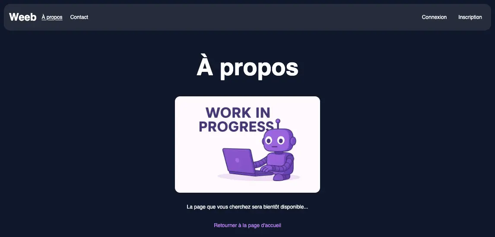

## 🌐 **Weeb**

<p align="center">
  
</p>

## 🧩 Presentation

**Weeb Frontend** developed as part of the Software Engineer program at DataScientest. This project is the first step in the Weeb's company website.

🎯 **Goal n°1**: implement the Home, Contact, and Login pages, to create solid foundation for future features (blog, authentication, ...).

🎯 **Goal n°2**: implement Blog, Article, and Profile pages. A user can:

- send a review (not authenticated)
- read all articles (not authenticated)
- create, update, delete an article if (authenticated and author)
- update profile infos and reset password (authenticated)

<p align="center">
  
  
  
  
  
  
  
  
  
</p>

## ⚙️ Tech Stack

- React - UI framework
- TypeScript - Static typing
- TailwindCSS - Utility first CSS framework
- Framer Motion - Animations
- Git - Version control
- Django - Rest API
- PostgreSQL - Database
- Mailtrap - Email testing & sandbox
- Cloudinary - Image & media storage

## 🚀 Installation

1. Clone the repository :

```bash
git clone https://github.com/LucileBch/weeb_lucile_bouchire.git
```

2. Navigate into frontend & install dependencies

```bash
  cd weeb_lucile_bouchire
  cd weeb_frontend
  npm install
```

3. Run frontend :

```bash
npm run dev
```

👉 Open in your browser: http://localhost:5173

4. Navigate into backend

```bash
  cd ../weeb_api
```

5. Create virtual environment & install dependencies:

```bash
python3 -m venv env
source env/bin/activate
pip install -r requirements.txt
```

6. Create and complete .env file with .env.example

```bash
cp .env.example .env
```

👉 Configure:

- JWT settings
- Supabase / PostgreSQL database
- Mailtrap SMTP
- Cloudinary credentials

7. Run migrations & create superuser:

```bash
cd api
python manage.py migrate
python manage.py createsuperuser
```

8. Run backend :

```bash
python manage.py runserver
```

👉 Open in your browser: http://127.0.0.1:8000

## 🗂️ Structure

Frontend

```bash
src/
├── app/
│   └── router/         # router configuration
│   └── layouts/        # global layouts
├── assets/             # images, icons, logos
├── components/         # re-usables components
├── core/               # context, hooks, utils,
│   ├── context/
│   ├── hooks/
│   ├── utils/
│   └── dtos/
├── pages/              # main pages
├── styles/             # style sheets
│   └── index.css       # main style sheet (Tailwind theme)
└── main.tsx            # entry point (no App.tsx needed with RouterProvider)
```

Backend

```bash
api/
├── api/                 # main project configuration
│   ├── __init__.py
│   ├── asgi.py             # ASGI config
│   ├── wsgi.py             # WSGI config
│   ├── authentication.py   # custom JWT authentication
│   ├── permissions.py      # custom user permissions
│   ├── settings.py         # global project settings
│   └── urls.py             # root api routes
│
├── articles/            # articles app
│   ├── admin.py            # admin config
│   ├── apps.py             # app config
│   ├── models.py           # database models
│   ├── serializers.py      # DRF serializers
│   ├── tests.py.           # unit tests
│   ├── urls.py             # articles routes
│   └── views.py            # APi views / logic
│
├── reviews/             # reviews app (same)
│
├── users/               # users app (same)
│
└── requirements.txxt/   # python dependencies
```

## 🧱 Next steps

- [x] implement backend (Python & Django Rest Framework)
- [x] implement database (PostgreSQL - Supabase)
- [ ] DevOps

## 👩‍💻 Contributors

- [@LucileBouchire](https://github.com/LucileBch) (main developer)

## 🙏 Thanks

Thanks to :

- [@DataScientest](https://formation.datascientest.com/catalogue-des-formations?utm_term=datascientest&utm_campaign=%5Bsearch%5D+data+analyst&utm_source=adwords&utm_medium=ppc&hsa_acc=9618047041&hsa_cam=14490023985&hsa_grp=126147897829&hsa_ad=542987827577&hsa_src=g&hsa_tgt=kwd-810260702289&hsa_kw=datascientest&hsa_mt=e&hsa_net=adwords&hsa_ver=3&gad_source=1&gad_campaignid=14490023985&gbraid=0AAAAACo3KhOZUQ45ahBWYkidWbjuxVotL&gclid=Cj0KCQjw9JLHBhC-ARIsAK4Phco3TtV67Nxy30GDwEt4dJ6qCS71Yx5iL8itcWQBQ38w50L6I9tgcegaAv6TEALw_wcB)
