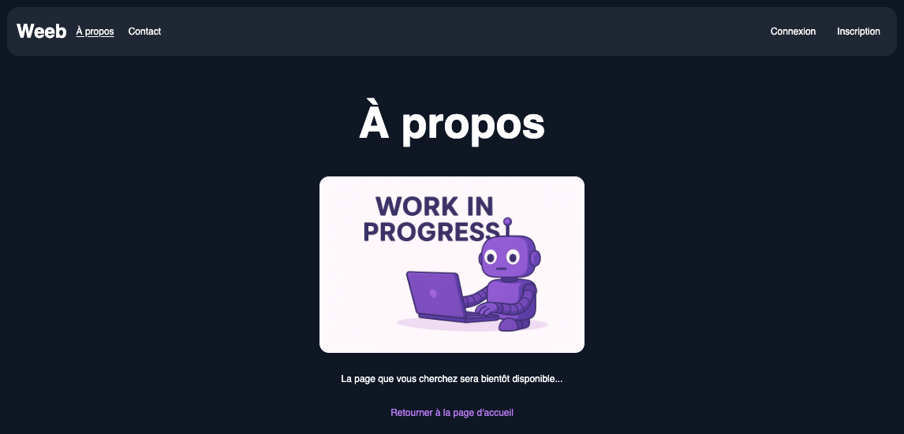

## 🌐 **Weeb**

<p align="center">
  
</p>

## 🧩 Presentation

**Weeb Frontend** developed as part of the Software Engineer program at DataScientest. This project is the first step in the design of Weeb's company website.

🎯 **Goal**: implement the Home, Contact,and Login Pages, to create solid foundation for futures features (blog, authentication, ...).

<p align="center">
  
  
  
  
  
</p>

- [x] **React**
- [x] **TypeScript**
- [x] **TailwindCSS**
- [x] **Framer Motion**
- [ ] Backend **Python** (_coming soon_)

## ⚙️ Tech Stack

- React - UI framework
- TypeScript - static typing
- TailwindCSS - utility first CSS framework
- Framer Motion - animations
- Git - version control

## 🚀 Installation

1. Clone the repository :

```bash
git clone https://github.com/LucileBch/weeb_lucile_bouchire.git
```

2. Navigate into the project

```bash
  cd weeb_lucile_bouchire
```

3. Install dependencies:

```bash
npm install
```

4. Run project :

```bash
npm run dev
```

5. Open in your browser

```bash
http://localhost:5173
```

## 🗂️ Structure

```bash
src/
├── app/
│   └── router/         # router configuration
│   └── layouts/        # global layouts
├── assets/             # images, icons, logos
├── components/         # re-usables components
├── core/               # context, hookds, utils, types
│   ├── context/
│   ├── hooks/
│   ├── utils/
│   └── types/
├── pages/              # main pages
├── styles/             # style sheets
│   └── index.css       # main style sheet (Tailwind)
└── main.tsx            # entry point (no App.tsx needed with RouterProvider)
```

## 🧱 Next steps

- [ ] implement backend (python, & django)

## 👩‍💻 Contributors

- [@LucileBouchire](https://github.com/LucileBch) (main developer)

## 🙏 Thanks

Thanks to :

- [@DataScientest](https://formation.datascientest.com/catalogue-des-formations?utm_term=datascientest&utm_campaign=%5Bsearch%5D+data+analyst&utm_source=adwords&utm_medium=ppc&hsa_acc=9618047041&hsa_cam=14490023985&hsa_grp=126147897829&hsa_ad=542987827577&hsa_src=g&hsa_tgt=kwd-810260702289&hsa_kw=datascientest&hsa_mt=e&hsa_net=adwords&hsa_ver=3&gad_source=1&gad_campaignid=14490023985&gbraid=0AAAAACo3KhOZUQ45ahBWYkidWbjuxVotL&gclid=Cj0KCQjw9JLHBhC-ARIsAK4Phco3TtV67Nxy30GDwEt4dJ6qCS71Yx5iL8itcWQBQ38w50L6I9tgcegaAv6TEALw_wcB)
